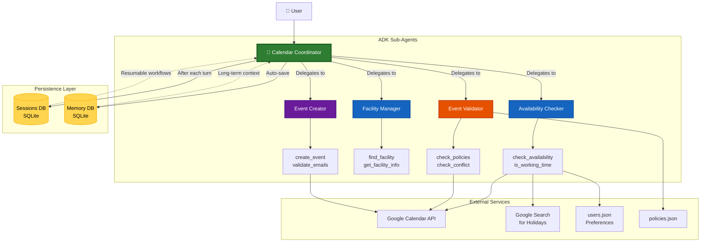
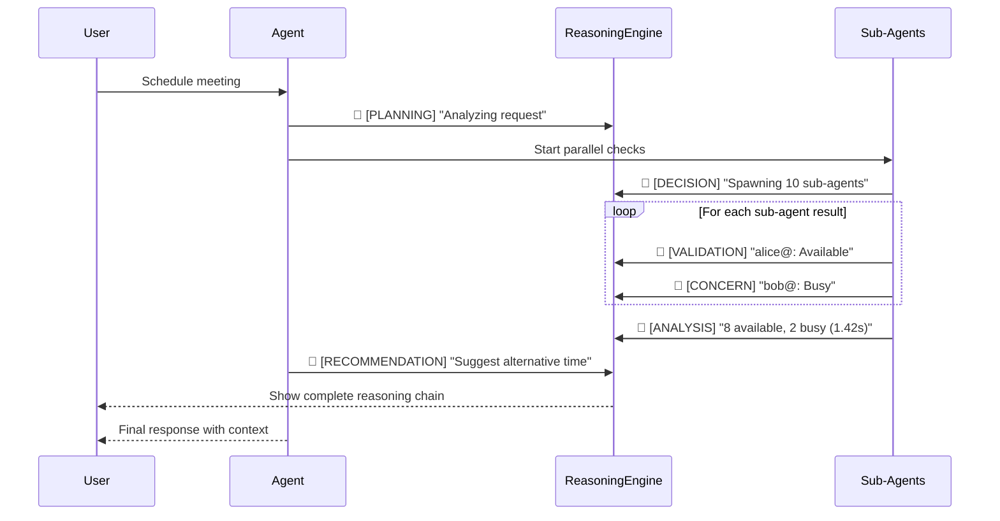

# AI Calendar Agent — Autonomous Meeting Scheduling for Enterprise Teams

## ⭐ Problem Statement — Why This Matters

Scheduling meetings in enterprise environments seems simple… until it isn’t. Teams frequently run into endless back-and-forth with invitees, time zone confusion, double-bookings, and misaligned facility calendars.

**The Traditional Approach:**
- 🐌 **Slow**: Checking 10 attendees sequentially takes 10+ seconds
- 🤕 **Error-prone**: Manual timezone conversions, missed conflicts
- 😓 **Tedious**: Juggling multiple tools (Calendar, Email, Room booking, Policy docs)
- 💸 **Costly**: ~100 hours/year wasted on scheduling for a mid-sized company

Most existing solutions (Calendly, Reclaim, etc.) don’t solve real enterprise constraints like proprietary email servers, facility booking, or zero-manual-work integration. And they incur costs! Which increases when team size grows.

**Our Solution:**
An **autonomous AI agent** that handles the entire scheduling workflow through intelligent orchestration of specialized sub-agents. It reduces scheduling time by **5-10x** while ensuring policy compliance and conflict-free meetings.

---

## ⭐ Why Agents? — The Right Approach

Traditional scripts can create events, but they **cannot**:
* Interpret natural language ("book a meeting tomorrow morning")
* Negotiate missing details or reason about constraints
* Autonomously check for conflicts before scheduling
* Fall back to different workflows when needed

**Agents solve this because they can:**
* Parse vague requests
* Call tools to check conflicts and availability
* Reason about timezones and policies
* Ask clarifying questions

In enterprise settings, this means a system that is **consistent**, **available 24/7**, and **scalable**.

---

## ⭐ What We Built — System Overview

We built a **Google Calendar–integrated Agent** using **Gemini 2.5-Flash** via the Google ADK. It features a hierarchical multi-agent architecture to handle complex workflows.

### System Architecture Overview

This diagram shows the complete multi-agent system with the **ADK hierarchical sub-agent architecture**.



### 🤖 Multi-Agent Architecture

Our system uses a coordinator and four specialized sub-agents:

```
Calendar Coordinator (Root Agent)
├── 🔍 Availability Checker → Parallel FreeBusy API calls
├── 🏢 Facility Manager     → Room search and booking
├── ✅ Event Validator      → Policy and conflict checking
└── 📅 Event Creator        → Calendar event creation
```

**Key Benefits:**
- **Parallel Execution**: Check 10 attendees in ~1.5s instead of 10s (7x faster)
- **Specialization**: Each sub-agent has focused responsibilities and tools
- **Fault Isolation**: Sub-agent failures don't crash the entire system

See [docs/architecture.md](docs/architecture.md) for detailed diagrams.

### 🧠 Session & Memory Persistence

The agent maintains context across restarts using SQLite:
- **Session Persistence**: Every interaction is stored in `data/calendar_agent_sessions.db`, allowing resumable workflows.
- **Long-term Memory**: Important context is extracted and stored in `data/calendar_agent_memory.db` with Full-Text Search (FTS).

---

## ⭐ The Build — Tools & Implementation

### 🔧 Tools & Capabilities

The agent leverages specialized tools with clean boundaries to interact with external systems:

| Tool Category | Tools | Purpose |
|--------------|-------|---------|
| **Calendar Integration** | `check_availability`, `create_event`, `check_conflict` | Google Calendar API for FreeBusy queries and event management |
| **Data Management** | `get_team_members`, `find_facility`, `get_user_details` | Search team/facility data from JSON files |
| **Validation** | `validate_emails`, `check_policies` | Email validation and org policy enforcement |
| **Intelligence** | `search_holidays`, `get_local_timezone` | Holiday detection via Google Search, timezone handling |

### ⚙️ Context Engineering

Long conversations can exhaust token limits. Our **ContextCompactor** optimizes context by intelligently summarizing older messages while preserving recent interactions, reducing token usage by **~70%** without losing continuity.

### 🔍 Observability: Chain-of-Thought

Transparency is critical. Our **ReasoningEngine** implements Chain-of-Thought (CoT) to make decision-making visible, logging thoughts like `[PLANNING]`, `[DECISION]`, and `[VALIDATION]` to trace the agent's reasoning process.

### Observable Reasoning Flow

How the reasoning engine integrates with the sub-agent system:



---

## ⭐ Project Setup Guide

This project uses **Python 3.14** and a **virtual environment**.

### 🚀 0. Clone the Repository
```bash
git clone <git@github.com:TheCapstoneTeam/calender_agent.git>
```

### 🔐 1. Setup Authorizations

**Google API Key**:
Create a `.env` file and add your key from [Google AI Studio](https://aistudio.google.com/app/api-keys):
```bash
GENAI_API_KEY={your_api_key}
```

**Google Calendar Credentials**:
Follow the [Google Workspace guide](https://developers.google.com/workspace/guides/create-credentials#oauth-client-id) to create OAuth credentials.

### 🧰 2. Create Virtual Environment

The `venv/` folder is **NOT** committed. Create your own:

**Linux / macOS**:
```bash
python3 -m venv venv
source venv/bin/activate
# OR using uv
uv venv
source .venv/bin/activate
```

**Windows**:
```bash
python -m venv venv
venv\Scripts\activate
```

### 📦 3. Install Requirements
```bash
pip install -r requirements.txt
# OR
uv pip install -r requirements.txt
```

---

## 📁 Folder Structure

```
.
├── data/                          # Static data & SQLite DBs
│   ├── calendar_agent_sessions.db # 💾 Session persistence
│   ├── calendar_agent_memory.db   # 💾 Long-term memory
│   ├── facilities.json            # Room definitions
│   ├── policies.json              # Org policies
│   └── users.json                 # Team data
│
├── docs/                          # Documentation & Diagrams
│
├── scheduler_agent/               # Main Source Code
│   ├── agent.py                   # Root ADK agent
│   ├── session_memory.py          # Persistence logic
│   ├── tools/                     # Modular tools
│   ├── sub_agents/                # ADK sub-agents
│   └── parallel_execution/        # Async optimization
│
└── tests/                         # Test Suite
```

---

## ✔️ Running the Project

**Run Tests:**
```bash
python -m pytest tests/
```
*Expected output: `==== 92 passed, 1 skipped, 1 warning in 10.44s ====`*

**Run the Agent:**
```bash
adk run scheduler_agent
```

---

## 🔍 Inspecting Data

The agent stores data in `data/`. We recommend using the **SQLite Viewer** extension in VS Code to inspect `calendar_agent_sessions.db` and `calendar_agent_memory.db`.

---

## ⭐ Future Improvements

### Phase 2 — Enterprise-Scale
* **CRUD Operations**: List, Update, and Delete events/teams.
* **Smart Booking**: Automatic negotiation of best common free slots.
* **Resource Management**: Booking vehicles, labs, and equipment.

### Phase 3 — Fully Autonomous
* **Proactive Scheduling**: Agent contacts participants and proposes times.
* **Security**: Granular authorizations and permissions.

---

## Contributors

- [Ella](https://github.com/ellacharmed): ideas, coding, testing, documentation, project management, presentation
- [Abir](https://github.com/Pro1943): coding, testing, documentation, 
- [Abdullah](https://github.com/abdullahzunorain): coding, testing
- [Ruqaiya](https://github.com/ruqaiyasattar): idea, documentation, presentation(?)
