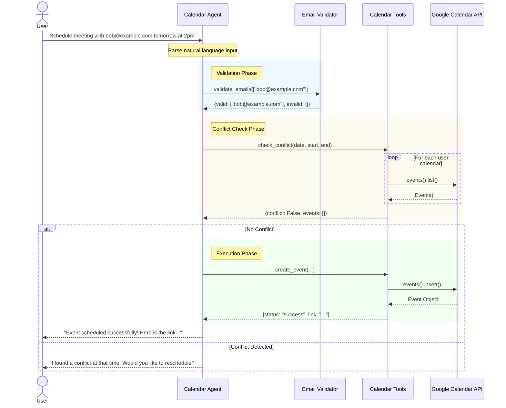
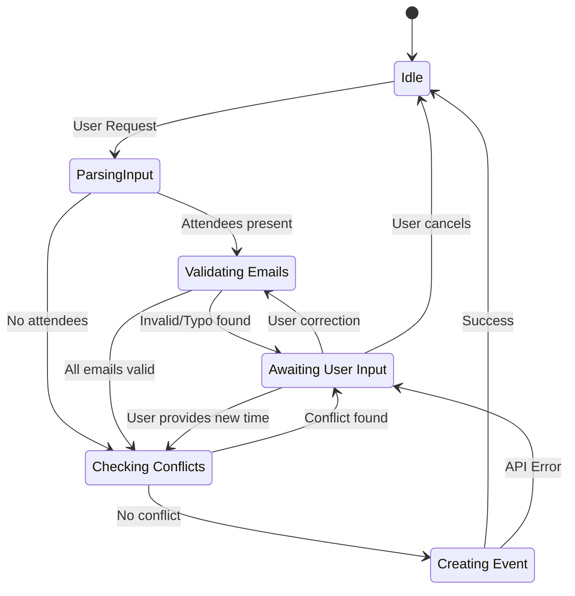

# Agent Workflow Diagrams

These diagrams visualize the operational flow of the Calendar Agent (`root_agent`).

## Sequence Diagram
This diagram shows the interaction between the User, the Agent, and its tools during a scheduling request.

## State Diagram
This diagram represents the logical states of the agent during a transaction.

