# Agent Workflow Diagrams

These diagrams visualize the operational flow of the Calendar Agent system, including the new **parallel sub-agent architecture**.

---

## System Architecture Overview

This diagram shows the complete multi-agent system with the **ADK hierarchical sub-agent architecture**.


---

## Sequence Diagram: ADK Delegation Flow

This diagram shows the interaction between the Root Agent and its Sub-Agents.


---

## State Diagram: Enhanced with Sub-Agent States

This diagram represents the logical states of the system including sub-agent orchestration.


---

## Parallel Execution Flow

This diagram visualizes how the parallel sub-agents execute concurrently.


**Note**: Sequential execution takes ~10 seconds, while parallel execution completes in ~1.3 seconds (slowest agent) = **7.7x faster**

---

## Data Flow Diagram

This diagram shows how data flows through the sub-agent system.


---

## Component Diagram

This diagram shows the system's component architecture.


---

## Performance Comparison

Visual representation of performance improvement:


---

## Observable Reasoning Flow

How the reasoning engine integrates with the sub-agent system:

```mermaid
sequenceDiagram
    participant User
    participant Agent
    participant Reasoning as ReasoningEngine
    participant SubAgents as Sub-Agents

    User->>Agent: Schedule meeting
    Agent->>Reasoning: 💭 [PLANNING] "Analyzing request"
    
    Agent->>SubAgents: Start parallel checks
    SubAgents->>Reasoning: 💭 [DECISION] "Spawning 10 sub-agents"
    
    loop For each sub-agent result
        SubAgents->>Reasoning: 💭 [VALIDATION] "alice@: Available"
        SubAgents->>Reasoning: 💭 [CONCERN] "bob@: Busy"
    end
    
    SubAgents->>Reasoning: 💭 [ANALYSIS] "8 available, 2 busy (1.42s)"
    
    Agent->>Reasoning: 💭 [RECOMMENDATION] "Suggest alternative time"
    
    Reasoning-->>User: Show complete reasoning chain
    Agent-->>User: Final response with context
```



---

## Session & Memory Management

The agent now maintains persistent sessions and long-term memory using SQLite databases.

```mermaid
graph TB
    User[👤 User] -->|"Interaction"| Agent[🤖 Calendar Coordinator]
    
    Agent -->|"Each turn"| SessionService[DatabaseSessionService]
    Agent -->|"After callback"| MemoryService[SQLiteMemoryService]
    
    SessionService --> SessionDB[("calendar_agent_sessions.db")]
    MemoryService --> MemoryDB[("calendar_agent_memory.db")]
    
    SessionDB -->|"Resume"| Agent
    MemoryDB -->|"Context"| Agent
    
    subgraph "Persistence Features"
        F1["- Full conversation history"]
        F2["- Resumable workflows"]
        F3["- Long-term memory"]
        F4["- Full-text search"]
    end
    
    style Agent fill:#2e7d32,stroke:#1b5e20,stroke-width:3px,color:#fff
    style SessionDB fill:#ffd54f,stroke:#fbc02d,stroke-width:2px,color:#000
    style MemoryDB fill:#ffd54f,stroke:#fbc02d,stroke-width:2px,color:#000
```



### How It Works

1. **Session Persistence**: Every user interaction is stored in `data/calendar_agent_sessions.db`
   - Allows resuming conversations later
   - Tracks full interaction history per session ID
   
2. **Memory Storage**: Important information is extracted and stored in `data/calendar_agent_memory.db`
   - Uses SQLite FTS (Full-Text Search) for efficient retrieval
   - Automatically saves context after each agent turn
   - Searchable with `session_memory_manager.search_memory(query)`

3. **Database Schema**:
   - **Sessions**: Stores events, states, and metadata per session
   - **Memories**: Stores content with full-text search support
   
### Usage Example

```python
from scheduler_agent.agent import session_memory_manager

# Resume a previous conversation
await session_memory_manager.run_session(
    ["What did we discuss last time?"],
    session_id="previous-session-123"
)

# Search through memories
memories = await session_memory_manager.search_memory("meeting rooms")
```

---

## Key Implementation Features

### Multi-Agent Architecture
- **Root Agent**: Main orchestrator using Google ADK
- **Parallel Sub-Agents**: Specialized agents for concurrent execution
- **Validation Agent**: Multi-dimensional validation coordinator
- **Policy Engine**: Rule-based validation system

### Performance Characteristics
- **Sequential**: O(n) where n = number of attendees
- **Parallel**: O(1) + network latency (constant time regardless of attendees)
- **Speedup**: 5-10x for typical use cases

### Observable Reasoning
- All agents log to shared ReasoningEngine
- Complete transparency of decision-making
- Real-time thought streaming
- Helpful for debugging and user trust

---

## Legend

| Symbol | Meaning |
|--------|---------|
| 🤖 | Root Agent |
| 👤 | User |
| 💭 | Thought/Reasoning |
| ✓ | Success/Available |
| ⚠️ | Warning |
| ❌ | Error/Blocking Issue |
| ✅ | Completed Successfully |

---

*These diagrams represent the enhanced calendar agent system with parallel sub-agent architecture implemented in November 2025.*
